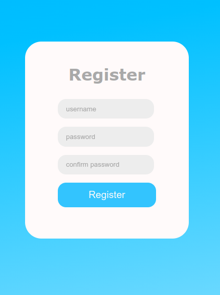
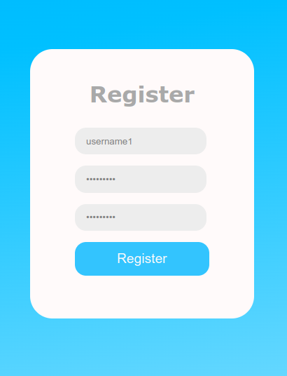
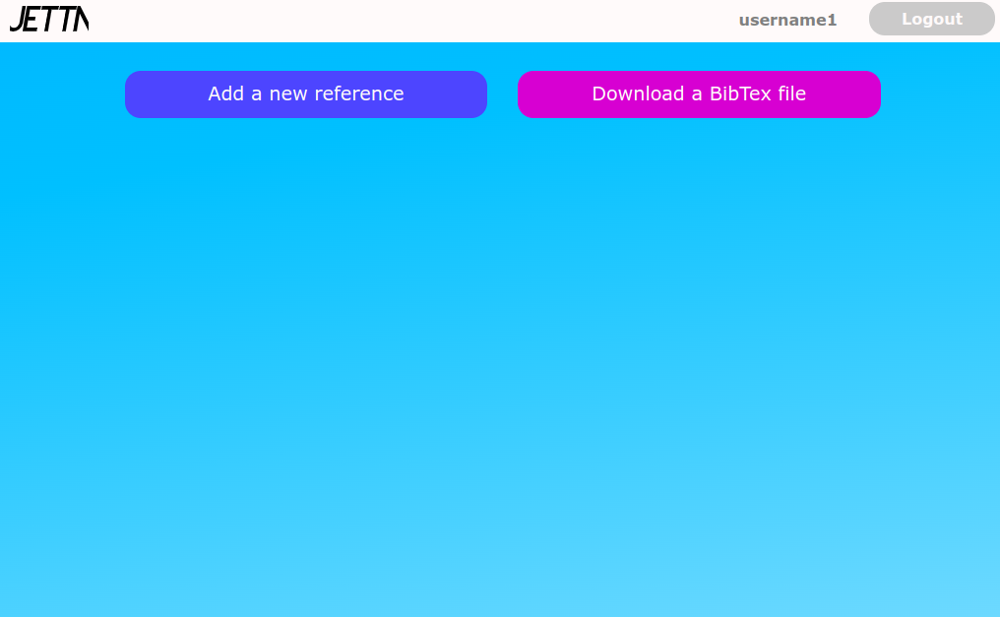
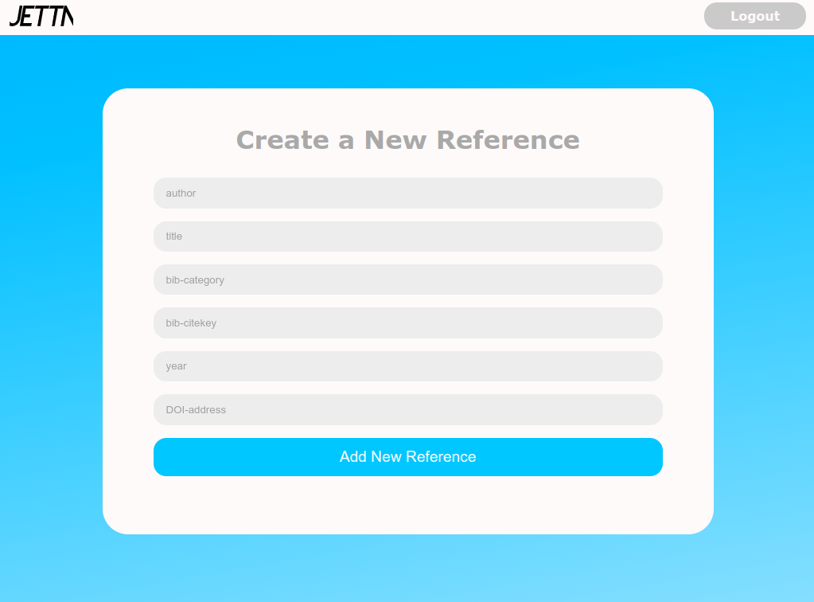
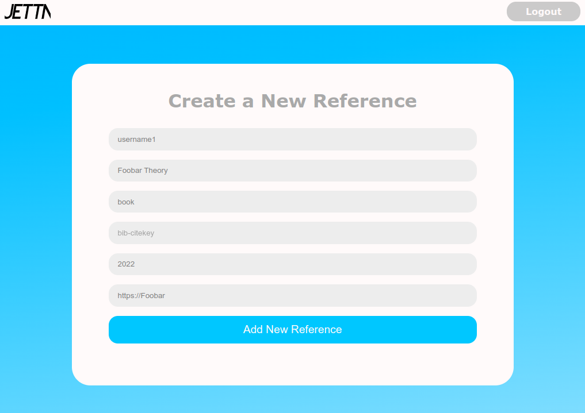
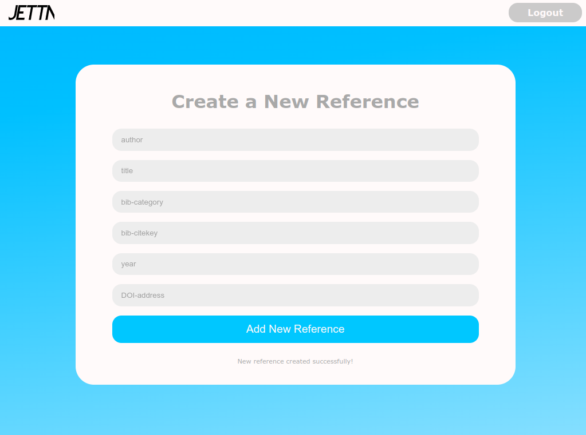
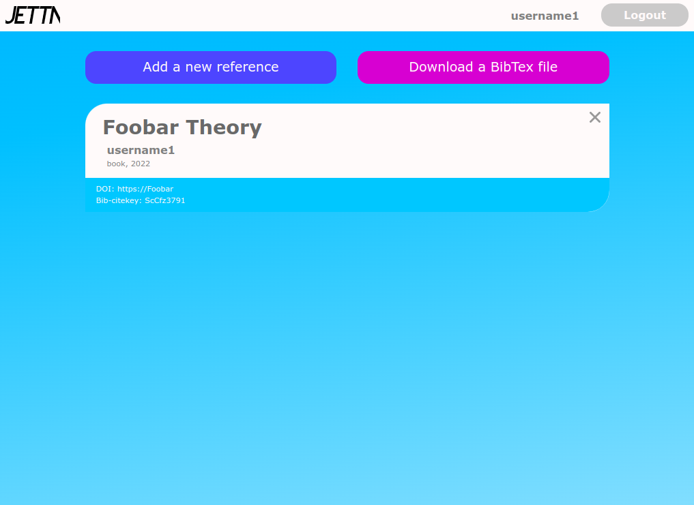

First you need to install software!

## Installation

How to use this software:
<br/>

In order to run this software
- Latest version of poetry must be installed.
- Python version 3.8 or greater must be installed.
<br/>

1. Clone this software in your terminal with command 
```bash
git clone git@github.com:Doubleneck/Jetta.git
```
or download the [latest release](https://github.com/Doubleneck/Jetta/releases/tag/v.2.0.0)
<br/>
<br/>

2. Install required dependencies inside of the Jetta root folder with command
```bash
poetry install
```
<br/>

3. Enter poetry shell with command
```bash
poetry shell
```
<br/>

4. Start application with command
```bash
python3 src/app.py
```
<br/>

5. Enjoy!
<br/>


## Software
\
When you start software, you go to login page, where you can login or click register button to register new user\
\
\
\
\
\
In register page you can register your own account.\
\
\
\
\
\
When you fill your username once and password twice, check you have username length atleast 3 characters long and max 35 characters.
Password must be over 7 characters and contains atleast one small letter, one big letter and one number.\
\
\
\
\
\
When you finally get your own user, you reach main page where you have already references or not have any. You can go to add a new reference, download a BibTex file or logout.\
\
\
\
\
\
If you pressed add a new reference button, you reach page where you can make a new reference. You can just add author, title, bib category, bib citekey, year and doi to text boxes. You must fill bib-category either book, article, phdthesisi or misc type and if you leave bib-citekey blank. It autogenerates you citekey so don't worry\
\
\
\
\
\
For example like this!\
\
\
\
\
\
If your reference is added. Software notifies about it with text 'New reference created successfully!'\
\
\
\
\
\
Now main page looks like this and citekey is randomly generated as well!!!\
\



You can just download BibTex file with pressing Download a BibTex file button and now you know how to use this software and enjoy!\
\
Latest version [Here](https://github.com/Doubleneck/Jetta/releases/tag/v.2.0.0) if you don't have it already
